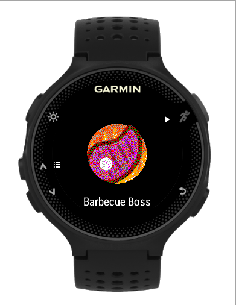
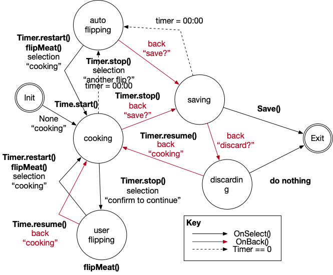

# Barbecue Boss ConnectIQ App for Garmin Watches.
Barbecue like a boss. An opensource app (https://github.com/arquicanedo/barbecueboss) for barbecue enthusiasts. In the initial version, it provides a searing timer (user-configurable for 1, 2, ..., 5 minutes) and flip confirmation to keep track of your steaks and veggies on the grill. It creates a "barbecue" activity and associates the GPS location to it whenever available. 

This version only supports circular watches.
Future release includes "smoking" timer in addition to the "searing" timer.

Other:
- Icon made by Pixel perfect from www.flaticon.com

## Screenshots

 

## Useful Documentation
- https://developer.garmin.com/connect-iq/programmers-guide/
- https://developer.garmin.com/downloads/connect-iq/monkey-c/doc/Toybox.html
- https://forums.garmin.com/developer/connect-iq/f/discussion
- https://github.com/garmin/connectiq-apps

## State Machine

