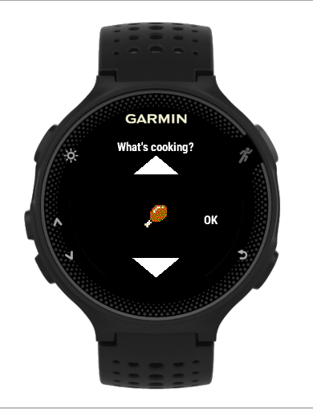

# Barbecue Boss ConnectIQ App for Garmin Watches.
Barbecue like a boss. An opensource app (https://github.com/arquicanedo/barbecueboss) for barbecue enthusiasts. In the initial version, it provides a searing timer (user-configurable for 1, 2, ..., 5 minutes) and flip confirmation to keep track of your steaks and veggies on the grill. It creates a "barbecue" activity and associates the GPS location to it whenever available. 

This project is licensed under the Apache 2.0 License. See LICENSE and AUTHORS for more information.

This version only supports round, semi-round and rectangular devices. Future release includes:
- "smoking" timer in addition to the "searing"/"flip" timer

Other:
- App/Launcher Icon made by Pixel perfect from www.flaticon.com

- Food type icons by:
Food Pixel Art Icons - Freepik https://www.flaticon.com/authors/freepik/

## What's New

1.2.0 -
- icons and cook times are preserved from the last session
- support for 416x416 pixel devices (epix, D2Air, D2 Mach 1, Venu 2, Venu 2 Plus)
- lots of layout tweaks and memory optimizations
- project is now modernized to compile with Visual Studio code 

1.1.0 -
 - brought to you by warmer temperatures and more outdoor cooking
 - added icons everywhere to denote food types, show what buttons do what actions
 - added the ability to track and re-use the last selected timeout
 - lots of tweaks to reduce memory usage while increasing visual attractiveness
 - added the ability to configure activity/gps enable/disable/recording
 - added icons to the food view to show if activity or gps are enabled
 - lots of layout tweaks for various devices
 - added a flame icon in addition to color-changing text as a timer approaches its deadline

1.0.0 - 
- brought to you by @nilsbenson (https://github.com/nilsbenson):
- adds vibration and sound when flip timer ends
- adds a "custom" timer duration
- activity recording is prompted when application ends rather than between runs of the flip (to make it easier to manage multi-step cooking processes in the future)
- general UI spacing adjustments

## Download
Download from the Garmin app store: https://apps.garmin.com/en-US/apps/bfbcb162-f215-49cb-8185-dad7e6dc4595

## Screenshots

 

## Useful Documentation
- https://developer.garmin.com/connect-iq/programmers-guide/
- https://developer.garmin.com/downloads/connect-iq/monkey-c/doc/Toybox.html
- https://forums.garmin.com/developer/connect-iq/f/discussion
- https://github.com/garmin/connectiq-apps
- https://developer.garmin.com/connect-iq/compatible-devices/

